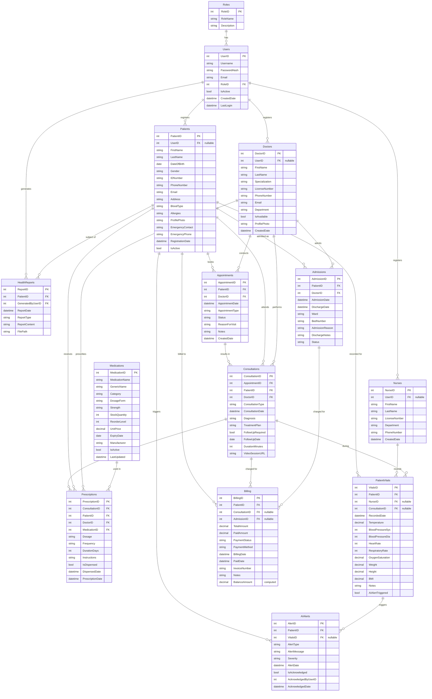

# SHTMS — Entity Relationship Diagram (ERD)
## Assessment 2 — SWP316D Group 1



---

## Table Summary

| # | Table | Primary Key | Foreign Keys | Description |
|---|---|---|---|---|
| 1 | **Roles** | RoleID | — | User roles (Admin, Doctor, Nurse, Receptionist) |
| 2 | **Users** | UserID | RoleID → Roles | System login accounts |
| 3 | **Patients** | PatientID | UserID → Users (nullable) | Patient demographics & medical profile |
| 4 | **Doctors** | DoctorID | UserID → Users (nullable) | Doctor profiles & specializations |
| 5 | **Nurses** | NurseID | UserID → Users (nullable) | Nurse profiles |
| 6 | **Appointments** | AppointmentID | PatientID → Patients, DoctorID → Doctors | Scheduled patient visits |
| 7 | **Consultations** | ConsultationID | AppointmentID → Appointments, PatientID → Patients, DoctorID → Doctors | Medical consultation records |
| 8 | **PatientVitals** | VitalsID | PatientID → Patients, NurseID → Nurses (nullable), ConsultationID → Consultations (nullable) | Vital signs measurements |
| 9 | **Medications** | MedicationID | — | Pharmacy inventory |
| 10 | **Prescriptions** | PrescriptionID | ConsultationID → Consultations, PatientID → Patients, DoctorID → Doctors, MedicationID → Medications | Prescribed medications |
| 11 | **Admissions** | AdmissionID | PatientID → Patients, DoctorID → Doctors | Inpatient admissions |
| 12 | **Billing** | BillingID | PatientID → Patients, ConsultationID → Consultations (nullable), AdmissionID → Admissions (nullable) | Patient billing & payments |
| 13 | **HealthReports** | ReportID | PatientID → Patients, GeneratedByUserID → Users | Generated health reports |
| 14 | **AIAlerts** | AlertID | PatientID → Patients, VitalsID → PatientVitals (nullable) | AI-triggered health alerts |

---

## Key Relationships

```
Roles ──< Users ──< Patients ──< Appointments ──< Consultations ──< Prescriptions >── Medications
                │                │                  │
                ├── Doctors ─────┘                  │
                │                                   │
                ├── Nurses ─────────────────────────┤
                │                                   │
                └── HealthReports                   │
                                                    │
Patients ──< Admissions ──< Billing                 │
Patients ──< PatientVitals ──< AIAlerts             │
Patients ──< Billing                                │
Consultations ──< Billing                           │
Consultations ──< PatientVitals                     │
```

---

## How to View This ERD

1. **GitHub**: The Mermaid diagram renders automatically when viewing this file on GitHub.
2. **VS Code**: Install the "Markdown Preview Mermaid Support" extension.
3. **Online**: Paste the Mermaid code block into [Mermaid Live Editor](https://mermaid.live/).
4. **PDF Export**: Use Mermaid Live Editor to export as PNG/SVG for your submission.